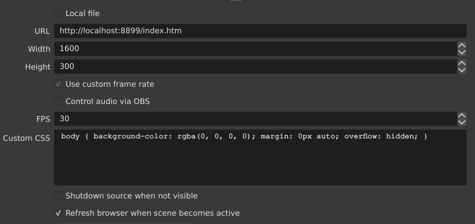

<!-- markdownlint-disable MD013 MD034 -->

# __Now Playing__ in Serato 

(For users testing 3.x, see updated documentation at [here](https://whatsnowplaying.github.io/). )

__Now Playing__ is a tool written in Python to retrieve the current/last played song in Serato DJ
(as tested with v2.4.x).

Compiled, standalone versions are available for:

* Windows
* macOS (10.13/High Sierra to 10.15/Catalina)
  * We do not yet have binaries for 10.11/Big Sur or M1.

For everyone else, you will need to build and install locally.  See [Developers](#Developers) below.

## Versus Comparisons

There are a lot of different solutions to provide titling for your stream. While
we would love for you to choose and and work with us, we are realistic that this software
may not be the one for you.

### Serato's Now Playing Twitch Extension

|  Description | This App | Serato Extension |
|:--------------- |:----------- |:------------ |
| Works locally | :heavy_check_mark: | :x: |
| Works with Live Playlists | :heavy_check_mark: | :heavy_check_mark: |
| Cover art | :heavy_check_mark: | :x: |
| Multi-DJ on one stream friendly | :heavy_check_mark: | :x: |
| Album name can be displayed | :heavy_check_mark: | :x: |
| Label/Publisher can be displayed | :heavy_check_mark: | :x: |
| High degree of customization via templates | :heavy_check_mark: | :x: |
| Open source | :heavy_check_mark: | :x: |
| Supports multi-deck | :heavy_check_mark: | :x: |
| Ability to give data to other programs to manipulate | :heavy_check_mark: | :x: |
| Supports 2-computer streaming | :heavy_check_mark: | :heavy_check_mark: |

## Considerations and Pre-requisites

__Now Playing__ was developed and tested in an environment using a Serato DJ compatible controller.

*NOTE*: Serato in DVS mode has not been tested. Behavior regarding the timing of song updates is not known. If song updates occur too quickly with DVS, try the Remote mode.

__Only applies when using the Remote Mode to retrieve track data:__

* Active internet connection is required
* Serato account required with Live Playlists enabled

For more info on Serato Live Playlists: https://support.serato.com/hc/en-us/articles/228019568-Live-Playlists

## Installation

### Mac

* Download the latest macOS release zip package [here](https://github.com/whatsnowplaying/whats-now-playing/releases/latest)
* Unzip the archive and place the unzipped 'SeratoNowPlaying.app' file in your "Applications" folder or any other location that you desire.

#### *Important note for macOS users*

Due to security measures in macOS Sierra and later, unsigned apps may have limitations placed on them.  These limitations
will prevent them from operating correctly or even opening at all. Opening the app on High Sierra and newer versions of macOS by following the
steps below. Versions before High Sierra have not been verified and are not currently supported.

* Do not unzip the downloaded zip package directly to the folder from where you will be running it. Instead, unzip it in a location such as the "Downloads" folder
  and then move the 'SeratoNowPlaying.app' to your destination folder (e.g.,
  "Applications"). Then run the app from the destination folder.
* If the app fails to open, try holding down the Control key and then double-clicking open.
* If after following the step above the app does not open, open Terminal and type:
  ```sudo xattr -r -d com.apple.quarantine /path/to/MyApp.app``` (replace with the correct path to the app).

### Windows

* Download the latest Windows release zip package here: [here](https://github.com/aw-was-here/releases/latest)
* Unzip the package and copy the entire unzipped folder containing the
  'SeratoNowPlaying.exe' file and supporting files to the directory you'd like the app to run from (i.e., C:\Program Files).

#### *Important note for Windows users*

Microsoft has beefed up Windows security and you may now get prompted about an unsigned binary.  Click on 'More Info'
and then 'Run Anyway' to launch __Now Playing__.

## Usage

Start the __Now Playing__ app from the location where you placed it. On Windows, you may need to right-click and
select "Run as Administrator'. The app is controlled and configured by accessing the menu from the icon in the
Windows system tray or Mac menu bar after configuration.

However, the first time you run the app a [Settings](#settings) window will appear. Populate the fields
accordingly, and press Save. Once saved, the app will start polling for new songs. The app can be controlled
and exited from the Windows system task tray or the macOS menu bar icon.

 Windows

 macOS

### Menu Bar Options

* __Settings__ - Reconfigure the application after going through the initial configuration.
See [Settings](#settings) for more information.

* __Oldest/Newest__ - Toggle that determines which mixing mode is currently used.
  * Oldest mode will pick the oldest track from all decks.  This setting for DJs who are using the
  non-playing deck or will be manually controlling cross-fades.
  * Newest mode will pick the newest track from all decks.  This setting is helpful for pre-built
  playlists or Serato's AutoDJ capability.

* __Pause/Unpause__ - Determines whether __Now Playing__ is looking for data and writing an updated title.

* __Exit__ - Stop and exit __Now Playing__

### Uninstallation

The process for uninstalling the app is the same on both platforms.  Delete the
file or folder from the location to where you pasted it.  Preferences will be retained
you wish to re-install it.  If you want to remove those too, they will be in the standard place
for your particular operating system (AppData for Windows, Library/Preferences for OS X, etc.)

## Settings

Upon initial execution of the app, a settings window will appear. The icon in the Windows task tray or Mac menu bar may be used to access the app settings after this first configuration.

### General Settings

* __Track Retrieval Mode__ - Select either Local or Remote mode.  Local is the preferred method of retrieval and the default.
  * Local mode uses Serato's local history log to acquire the track data. [How to use Local Mode](#local-mode)
  * Remote mode retrieves remote track data from Serato Live Playlists.  This mode requires constant connection to the internet and a Serato account with Live Playlists enabled. [How to use Remote Mode](#remote-mode)

* __Serato Library Path__ - (_Local Mode Only_) Location of the folder that contains Serato library and history data.  This folder named "\_Serato\_" is created and used by Serato DJ. If you keep your library on an external drive, you will have two "\_Serato\_" folders - one on the external drive and the other in the "Music" folder of your internal drive.  You must select the internal drive folder, as it is the one that contains the history folder and log files.

* __URL__ - (_Remote Mode Only_) The web address of your Serato Live Playlist
  * This should be something like: ```https://serato.com/playlists/<<USERNAME>>/live```

* __Polling Interval__ - (_Remote Mode Only_) The amount of time, in seconds, that must elapse before the app checks for a new track.  If not populated, it will default to 10 seconds.
  * The goal is to retrieve the new track info immediately as it's updated to the Serato website.  However, too short of an interval could affect the website's performance.

* __Notification Indicator__ - Selecting this option will show a system notification when new track info is detected.
  * This is useful for verifying that the app is polling and retrieving data.
  * The notification displays the track information after detection.

* __File__ - Name of the file where the app will write the track information.  You can either pick a pre-existing file or the name of a new file.

* __TXT Template__ - The [Jinja2 template](https://jinja.palletsprojects.com/en/2.11.x/templates/) file that will be used when the song updates. See [More on Template Files](#more-on-template-files) below.

* __Write Delay__ - The amount of time, in seconds, to delay writing the new track info once it's retrieved. If not populated, it will default to 0 seconds.
  * A setting of zero will update the track info on-screen immediately as a new track is detected.  This time value may be too soon for some DJ's mixing style. Increasing the write delay allows for much more tuning.

* __HTTP Server Support__ - Enable a local HTTP server that can be used to fetch formatted song information.  Enabling this option requires Now Playing to be restarted to take effect.

* __Port__ - The HTTP server's TCP port.  For security reasons, a firewall should protect this port to limit which hosts will be permitted to connect.

* __HTML Template__ - The [Jinja2 template](https://jinja.palletsprojects.com/en/2.11.x/templates/) file that will be used when the song updates. See [More on Template Files](#more-on-template-files) below.

* __Server Path__ - Directory to store the webserver files.  If
the field is blank, the app will use a temporary directory.

* __Logging Level__ - By default, __Now Playing__ will write debug logs into your Documents/NowPlaying/Logs directory.
This option lets you control the level of logging.

* __Reset/Cancel/Save__
  * Reset - Switch settings back to factory defaults.
  * Cancel - You've changed your mind and would like to go back to your previous saved settings.
  * Save - Save these settings to activate now and use for future application launches.

### Local Mode


When Local Mode is active,  the __Now Playing__ app runs on the same machine as Serato.  Configure the Serato Library Path to Serato's directory, usually `Music/_Serato_`.  This method is the recommended installation as much more information is available and significantly improves __Now Playing__'s correctness.

### Remote Mode


Remote mode is useful when the streaming computer is not the same as the Serato DJ computer but the HTTP Server
Mode cannot be used.

1. In Serato, make sure you enable Live Playlists and start a new session. From the [Serato website](https://support.serato.com/hc/en-us/articles/228019568-Live-Playlists):

    >"To enable the Live Playlists feature, go to the Expansion Pack tab on the Setup screen and check the Enable Live Playlists option. Once enabled, the Start Live Playlist button is now displayed in the History panel. Click this to start and stop your Live Playlist session."

2. Once a new playlist session is started, Serato will automatically open your web browser to your Live Playlist. __IMPORTANT:__ You will need to select "Edit Details" on the Live Playlist webpage and change your playlist to "Public", or else the __Now Playing__ app will not be able to retrieve any song data. The webpage does not need to remain open.  So you can close it once you ensure that the playlist has been made public.

3. Start the __Now Playing__ app.  The app can be controlled and configured by accessing the menu from the icon in the Windows system tray or Mac menu bar.

Be aware that as of this writing (2021-03-05), the only information available via Live Playlists is the artist and the title
due to limitations on the Serato-side.

### HTTP Server Mode

__Now Playing__ has the ability to serve a web page after a song change.  This option
allows users to utilize features such as the OBS Browser source for dynamically
changing content.

For example, the `cover-artist-title.htm` template draws the cover image, the title, and the artist
in a 1600x300-sized box for Local Mode installations with their files properly tagged.
Assuming OBS is running on the same machine as __Now Playing__, we would need to configure it to
match:



We then end up with this image fading in and out when we play Björk's live rendition
of "Venus as a Boy" from Debut - Live:


To build your own templates, see [below](#more-on-template-files).

#### Supported URLs

There are many URLs supported:

* /index.html (or /index.htm or just /)

This URL generates either a title card based upon the preconfigured template or
a refresh document.  The title card will be given exactly once upon connection with
the refresh document being returned in subsequent connections until a new track has
been detected.  This process allows for using fades and other HTML tricks.

* /index.txt

Returns the content of the plain text file that was written.

* /cover.jpg or /cover.png

This URL will return the cover image, if available. It recommended to use the '{{ coverurl }}'
template variable to determine which one to use. Note that the format (JPEG or PNG) is entirely
dependent upon the store image in the media.  __Now Playing__ does not do image conversion or
support more than JPEG or PNG images.

* /favicon.ico

This URL will return __Now Playing__'s icon.

#### Extra Content

For security reasons, __Now Playing__ will ONLY serve either the HTTP refresh page or the titlecard.  Any other
content (images, CSS, JavaScript libraries, etc) must come from another source.

## More on Template Files

In order to provide maximum formatting flexibility, [Jinja2 template](https://jinja.palletsprojects.com/en/2.11.x/templates/)
files are used to format the output.  __Now Playing__ provides several built-in example templates that
may be modified as necessary to suit your needs.  The examples have been copied to your Documents/NowPlaying
folder.

Currently supported variables:

| Variable       | Description |
|:--------------:|:-----------:|
| album          | Album track comes from |
| albumartist    | Artist listed on the album |
| artist         | Artist for the song |
| bitrate        | Bitrate the file was encoded at |
| bpm            | Beats per minute of the song |
| composer       | Composer of the song |
| coverurl       | Location to fetch the cover |
| coverimageraw  | Raw bytes of the cover image |
| coverimagetype | Kind of image in rawcoverimage |
| disc           | Disc number |
| disc_total     | Total number of discs in album |
| filename       | Local filename of the media |
| genre          | Genre of the song |
| key            | Key of the song |
| lang           | Language used by the media |
| publisher      | Publisher of the media |
| title          | Title of the media |
| track          | Track number on the disc |
| track_total    | Total tracks on the disc |
| year           | Year or date of the media |

Two important notes:

* As of this writing (2021-04-02), Remote Mode only has the artist
and the title information available.  This is a limitation in Serato.**
* Your media files may or may not have all of this information available.  If they do not, we
recommend using a tool such as [Musicbrainz Picard](https://picard.musicbrainz.org/)
to fill in as much information as possible as easily and accurately as possible.
* `coverurl` is only active if the HTTP Server Mode is enabled.

### Template Examples

Let us pretend that [Björk's Jóga](https://musicbrainz.org/recording/83534ada-9f60-4093-bbf3-ca182a03cf8b) was
the currently playing song.

Given a template like this:

```jinja
{{ artist }} - {{ title }}

```

__Now Playing__ would generate:

```text
Björk - Jóga
```

If the application is running in [local mode](#local-mode), then we could use more a template with
more content.  A template such as:

```jinja
Song: "{{ title }}"
Artist: {{ artist }}
Album: {{ album }}
```

would generate:

```text
Song: "Jóga"
Artist: Björk
Album: Homogenic
```

Since we are using [Jinja2 templates](https://jinja.palletsprojects.com/en/2.11.x/templates/), we
also have some special effects available to us:

Uppercase:

```jinja
{{ artist | upper }}
```

turns into:

```text
BJÖRK
```

Maybe our media files are not quite correct and they have 'björk'?  We can easily capitalize them in the template:

```jinja
{{ artist | capitalize }}
```

Ta-da:

```text
Björk
```

There are many many other things one can do with the Jinja templating system.  Please
see [the documentation](https://jinja.palletsprojects.com/en/2.11.x/templates/) for more
information and ideas!

## Developers

```text
    NOTE: For people familiar with Python, it is HIGHLY RECOMMENDED that you use and
    build with venv due to the restrictive requirements of the tested packages listing.
    While newer versions MAY work, there is no guarantee that PyInstaller and other
    utilities will build a proper executable.
```

### Development Requirements

To locally build and install __Now Playing__, you will need the following:

1. Python for your operating system (3.8 or higher is recommended)
2. Access to a development shell (e.g., /Applications/Utility/Terminal on OS X)
3. `git` installed and working

### Commands

```bash
python -m venv (virtualenv directory)
source (virtualenv directory)/bin/activate
git clone https://github.com/aw-was-here/Now-Playing-Serato
cd Now-Playing-Serato
pip install .
```

At this point, you should be able to run the software from the shell:

```bash
NowPlaying
```

### Build Executable

To build a stand-alone executable, you will need to run PyInstaller:

```bash
pyinstaller NowPlaying.spec
```

There should now be a `dist` directory and inside that directory will be
either a `NowPlaying.app` on OS X or just a `NowPlaying` single file.

## Changes from previous versions

See the [CHANGELOG](CHANGELOG.md) file.
