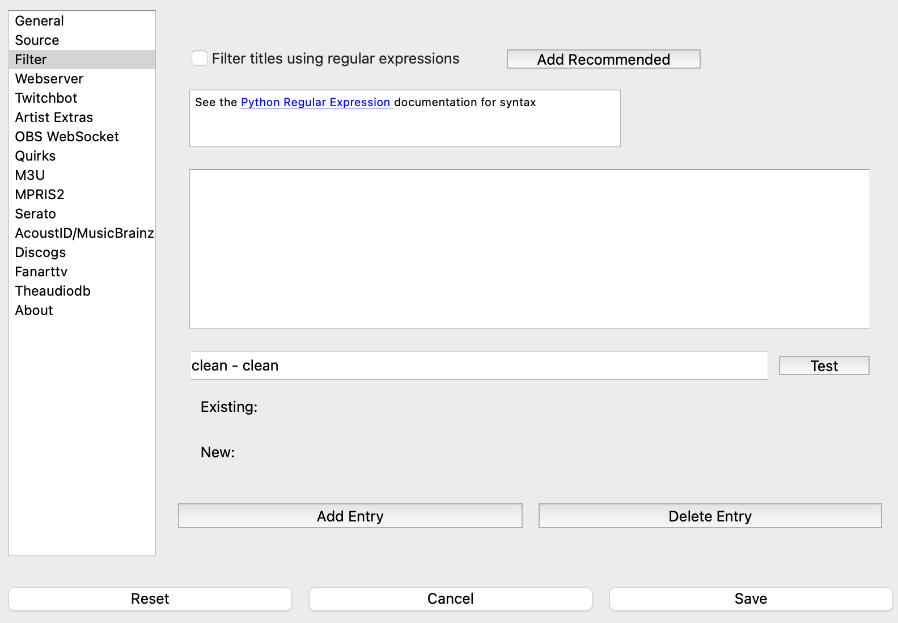

Filter
======

Some DJ Pools add extra identifiers to track titles.  **What's Now Playing** has the ability to remove
extra text from the title of a track using
`Python-style regular expressions <https://docs.python.org/3/howto/regex.html>`_ .

Adding Your Rules
-----------------

Your custom rules may be added by:

1. Click the Add Entry button
2. Click on the 'new' entry
3. Edit to be a regular expression

To delete an existing entry:

1. Select the entry in the list
2. Click Delete Entry

The order in which the rules are applied are done in the same order as presented in
the list.  To change the order, select the entry and drag it to the location in the
list.

Testing Your Rules
------------------

The text line below the ruleset may be used to test the rules.

1. Place your text in the 'clean - clean' line.
2. Click the Test button
3. The software will then show wbat happens will the rules defined in Settings and
   the rules as previously saved.

Recommended
------------

Previous versions had some built-in rules to remove a few common entries.
Clicking on the 'Add Recommended' button will add those rules:

.. image:: images/filterrecommended.png
   :target: images/filterrecommended.png
   :alt: Add Recommended

* ' (Clean)', ' (clean)', and all other variations of case like ' (ClEaN)'
* At the end of the line: ' - clean', ' - Clean' and similarly is case insensitive
* ' [Clean]' and ' [clean]' and smiliarly is case insensitive

They will also remove the same types of variations of:

* explicit
* dirty
* official music video

