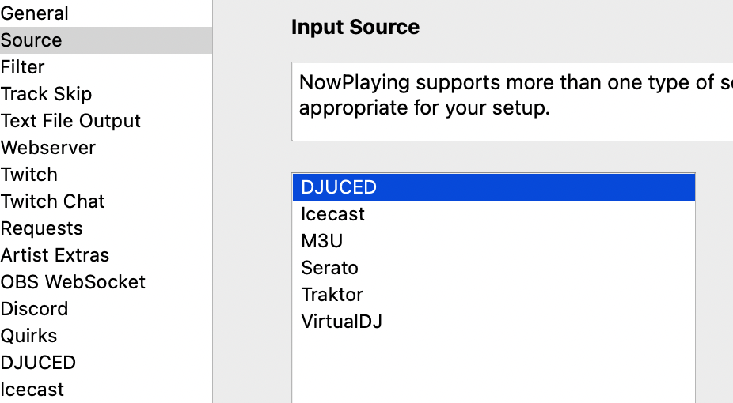
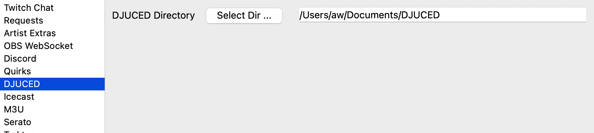
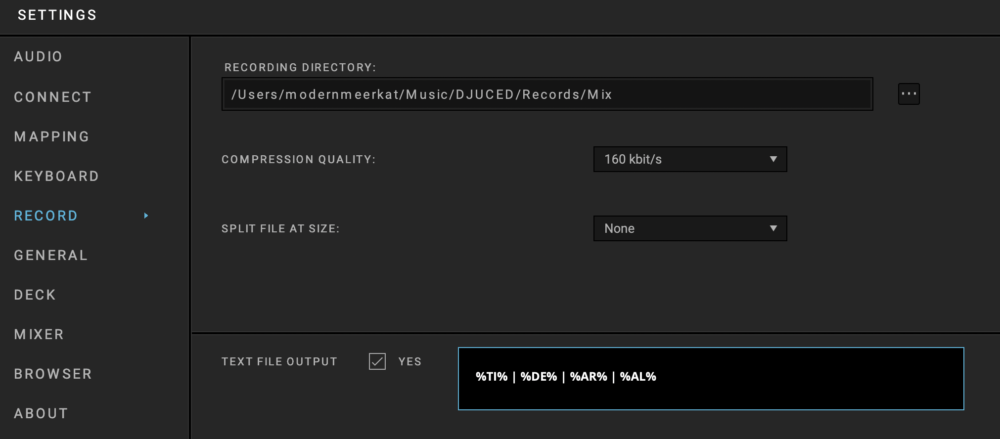

DJUCED Support
==============

** Experimental **

DJUCED is DJ software built by Guillemot Corporation for their line of Hercules controllers.

      NOTE: This source does not support Oldest mix mode.

      NOTE: Only tested with DJUCED 6.0.1

Instructions
------------

#. Open Settings from the **What's Now Playing** icon
#. Select Input Source from the left-hand column
#. Select the DJUCED from the list of available input sources.

#. Select DJUCED from the left-hand column.
#. Enter or, using the button, select the directory where the DJUCED files are located.

#. Click Save
#. In DJUCED, go into Settings -> Record. Turn on Text File Output.
#. Change the Format to be: ``%TI% | %DE% | %AR% | %AL%``

#. The file name of the output file is expected to be the default `playing.txt` and as well as stored in the DJUCED directory.
