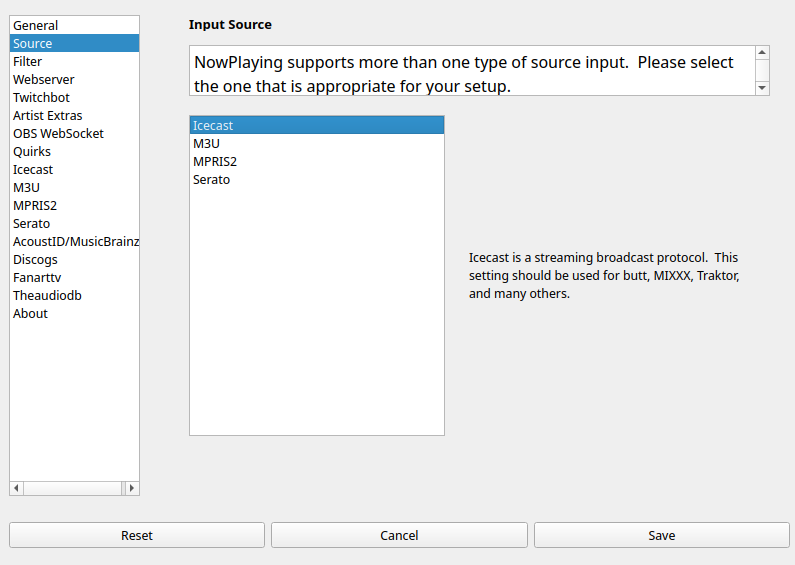
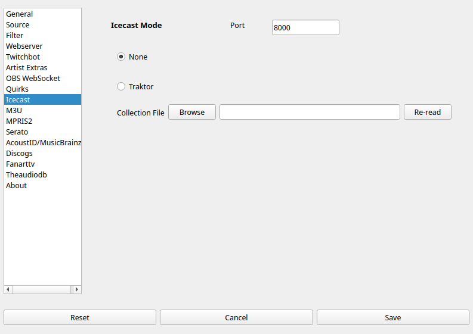
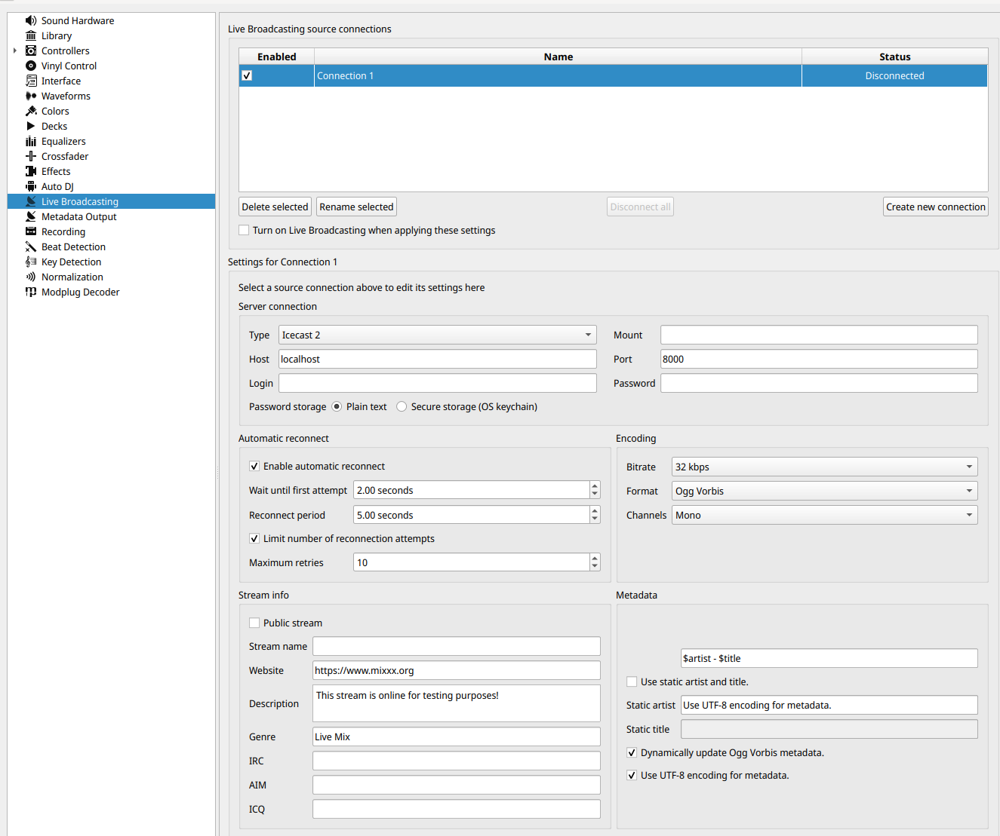
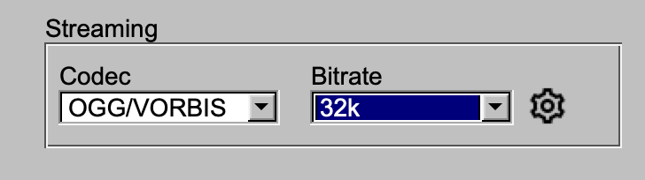
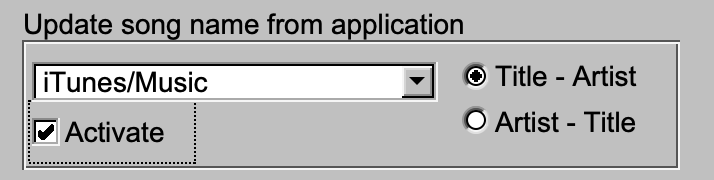

Icecast
=======

`Icecast <https://icecast.org/>`_ is a popular system to stream
audio over the Internet. It is supported directly by software such
as `MIXXX <https://mixxx.org/>`_ and `Traktor <https://www.native-instruments.com/en/catalog/traktor>`_ .
Additionally, programs such as `butt <https://danielnoethen.de/butt>`_ allow one to
stream nearly any audio source.

      NOTE: This source does not support Oldest mix mode.

      NOTE: Support for Icecast is very experimental.

Instructions
------------

#. Open Settings from the **What's Now Playing** icon
#. Select Input Source from the left-hand column

#. Select Icecast from the list of available input sources.
#. Select Icecast from the left-hand column.

#. If necessary, change the port from 8000 to another port, such as 5001.  (Hint: port 8000 appears to be used on macOS.)

#. Click Save
#. If you changed the Icecast port, restart **What's Now Playing**

Settings For MIXXX
------------------

   NOTE: MIXXX allows for significant screen customization. These images come from the 'Late Night' setting. Your display may be different.

#. Configure **What's Now Playing** as above
#. In Preferences, go to Live Broadcasting

#. Under Server Connection:
   #. Set the address to 127.0.0.1 for the same machine, otherwise change to the IP address of the machine that is running **What's Now Playing**.  (HINT: IP Address is visible on **What's Now Playing**'s Webserver setting page)
   #. Change the Port to match the port in **What's Now Playing**'s Iceast settings page.

#. Under Encoding, change the format to be 32 kbps, Ogg Vorbis, Mono.
#. Select 'OK' to exit Preferences
#. Back on the main MIXXX screen, activate Icecast broadcasting:

#. Click the 'On-Air' option.  It may appear as above or as an antenna.
#. It should change to a solid color, usually green. On error (there is usually a pop-up window), double check all settings in **What's Now Playing** and MIXXX to make sure they match.

Settings for butt
-----------------

Under Audio, be sure that Ogg Vorbis is selected:

Under Stream, if using the 'Update song name from application', be sure to use 'Title - Artist' mode.

