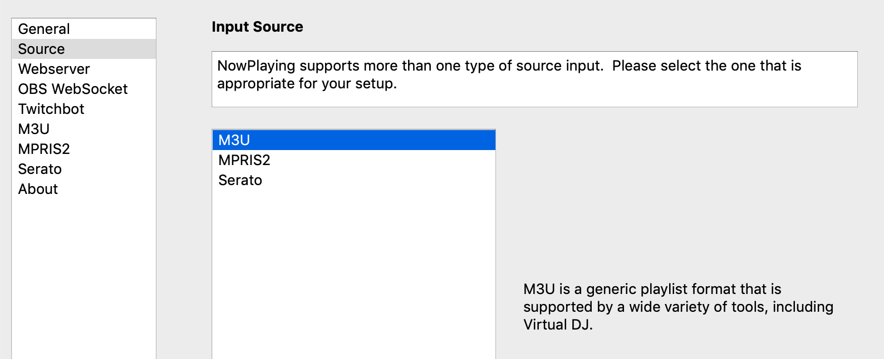
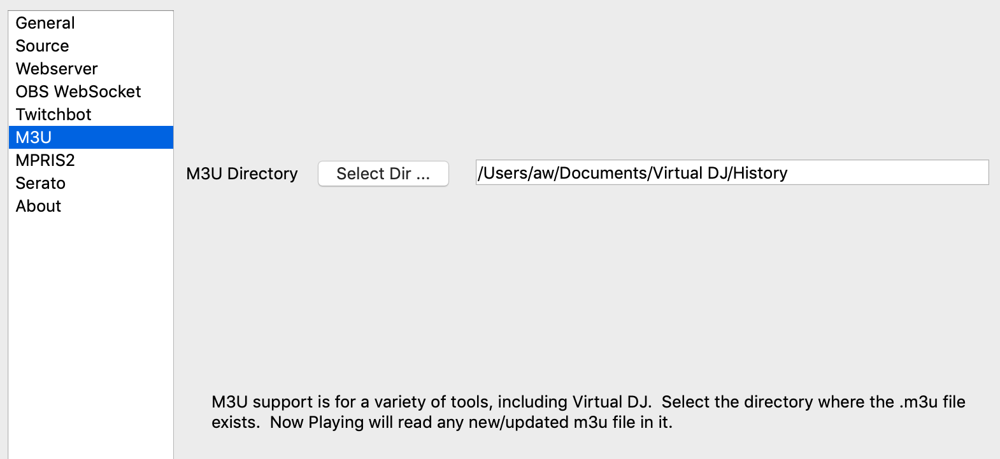

M3U Support
===========

M3U is a somewhat standardized file format that many different applications write. In particular, Virtual DJ uses this file format for its history.

      NOTE: This source does not support Oldest mix mode.

Instructions
------------

#. Open Settings from the **What's Now Playing** icon
#. Select Input Source from the left-hand column

#. Select the M3U from the list of available input sources.
#. Select M3U from the left-hand column.
#. Enter or, using the button, select the directory where your m3u files will appear.
   For Virtual DJ, this location should be your Documents/Virtual DJ/History directory.

#. Click Save

**What's Now Playing** will read that directory, reading the most current m3u file
for the currently playing track information.

