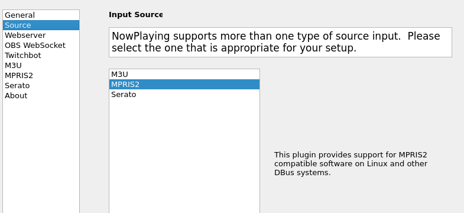
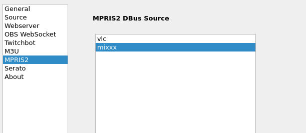

MPRIS2
======

`MPRIS2 <https://mpris2.readthedocs.io/en/latest/>`_ is a specification for
Linux DBus compatible music software to communicate with each other.
**What's Now Playing** supports reading track data from MPRIS2 sources, including VLC.

The `dbus-python` Python module must be installed in
the virtual environment to use MPRIS2 support,

      NOTE: This source does not support Oldest mix mode.

Instructions
------------

#. Open Settings from the **What's Now Playing** icon
#. Select Input Source from the left-hand column

#. Select the MPRIS2 from the list of available input sources.
#. Select MPRIS2 from the left-hand column.
#. Select from the detected MPRIS2 sources.
   Closing and re-opening the Settings UI will update the list.

#. Click Save
