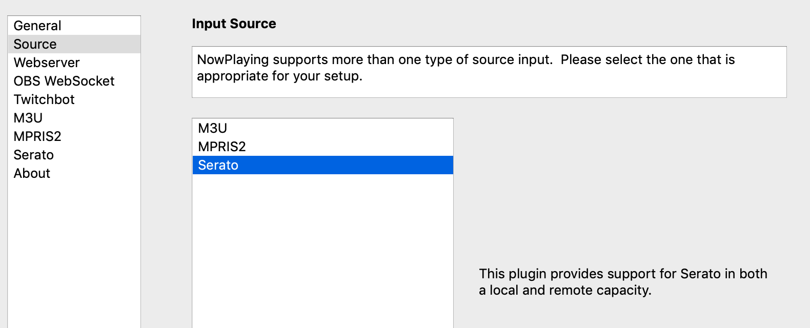
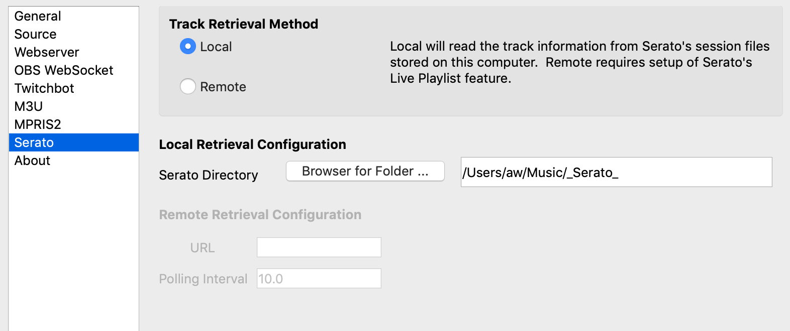
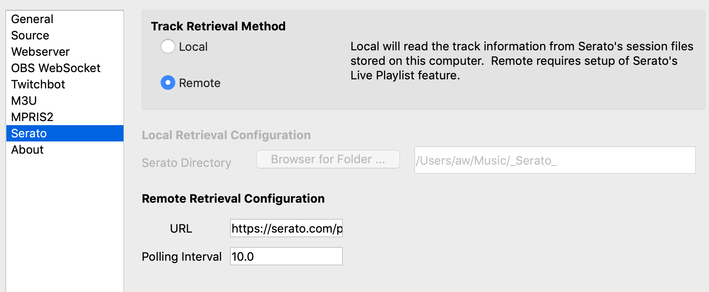

Serato
======

Serato is a commercial software package that runs on Mac OS X and Windows.  **What's Now Playing**
has two modes with which it may use Serato as an input: Local and Remote.

In Local mode, **What's Now Playing** will read the local session data on your computer directly.
This mode has much more data available to use but requires **What's Now Playing** to run on the
DJ computer.

In Remote mode, **What's Now Playing** will read
`Serato Live Playlists
<https://support.serato.com/hc/en-us/articles/228019568-Live-Playlists>`_
over the Internet.  This mode allows for **What's Now Playing** to run on a different computer
than the DJ computer, but does not have as much data available.

Instructions
------------

#. Open Settings from the **What's Now Playing** icon
#. Select Input Source from the left-hand column

#. Select the Serato from the list of available input sources.
#. Select Serato from the left-hand column.
#. Configure either Local or Remote mode as appropriate (see below)
#. Click Save

Local Mode
^^^^^^^^^^

When Local Mode is active,  the **What's Now Playing** app runs on the same machine as Serato.  Configure the Serato Library Path to
Serato's directory, usually ``Music/_Serato_``.  This method is the recommended installation as much more information is available
and significantly improves **What's Now Playing**\ 's correctness.

Ignore Deck(s) allows for tracks on these deck(s) to be ignored.

Remote Mode
^^^^^^^^^^^

Remote mode is useful when the streaming computer is not the same as the
Serato DJ computer by utilizing Serato Live Playlists. It should be only
used when **What's Now Playing**'s web server mode also cannot be used.

      NOTE: This mode does not support Oldest mix mode.

#.
   In Serato, make sure you enable Live Playlists and start a new session. From the `Serato website <https://support.serato.com/hc/en-us/articles/228019568-Live-Playlists>`_\ :

   ..

      "To enable the Live Playlists feature, go to the Expansion Pack tab on the Setup screen and check the Enable Live Playlists
      option. Once enabled, the Start Live Playlist button is now displayed in the History panel. Click this to start and stop your Live
      Playlist session."

#.
   Once a new playlist session is started, Serato will automatically open your web browser to your Live Playlist. **IMPORTANT:** You
   will need to select "Edit Details" on the Live Playlist webpage and change your playlist to "Public", or else the **What's Now Playing**
   app will not be able to retrieve any song data. The webpage does not need to remain open.  So you can close it once you ensure that
   the playlist has been made public.

#.
   Start the **What's Now Playing** app.  The app can be controlled and configured by accessing the menu from the icon in the Windows system tray or Mac menu bar.

Be aware that as of this writing (2021-03-05), the only information available via Live Playlists is the artist and the title due to limitations in Serato's offering.
