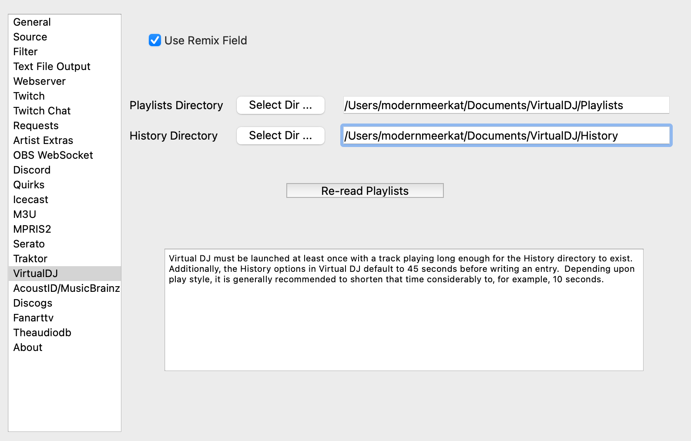

Virtual DJ
==========

The Virtual DJ input source is a specialized version of the `M3U source <m3u.html>`_
that also provides access to playlists for `Request support <../requests.html>`_ .

On install, the Virtual DJ directories should be set correctly for most
computers.  If they are not set correct, use the 'Select Dir' buttons to
point to the correct ones.

If the History does not exist, then you may need to change the time
on Virtual DJ's history output as well as actually play a track on a
deck long enough for the history file to be created.

Click the Re-read Playlists button to cause **What's Now Playing** to
re-read Virtual DJ's playlists for roulette-style requests.  Be aware that
playlist files are only updated when Virtual DJ is closed.
