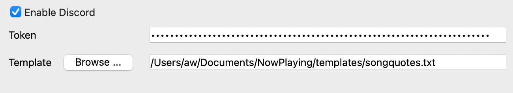

Discord
=========

**What's Now Playing**'s support of Discord is very preliminary at the moment.  It supports two modes of
operation, both of which may be done simultaneously:

Bot Mode:  Using a token, update the presence of a bot account that includes a link to your stream if
Twitch is also configured.

Client Mode: If the Discord app is running and a Client ID is provided, update the Discord user's status
to the playing song.

Configuration
--------------

Generic Settings
^^^^^^^^^^^^^^^^

#. In order to even start with Discord mode, it must be enabled
#. The template selected here is what will be used to fill in the status text.

Client Mode
^^^^^^^^^^^^

#. If the Discord app is not running, start it first.
#. Go to your `Discord Developers <https://discord.com/developers/>`_ page
#. Create an application
#. After naming, take the Client ID and put into **What's Now Playing**'s Discord page.
#. Restart **What's Now Playing**.  Subsequent launches will connect to Discord as long as the
   Discord app is already running.

Bot Mode
^^^^^^^^
#. Go to your `Discord Developers <https://discord.com/developers/>`_ page
#. Create an application
#. Build-a-bot
#. Make a note of the token from the bot page
#. Invite your bot to your Discord channel
#. Put that token into the Discord settings
#. Restart **What's Now Playing**.  Subsequent launches will connect to Discord as long as the
   Discord app is already running.
