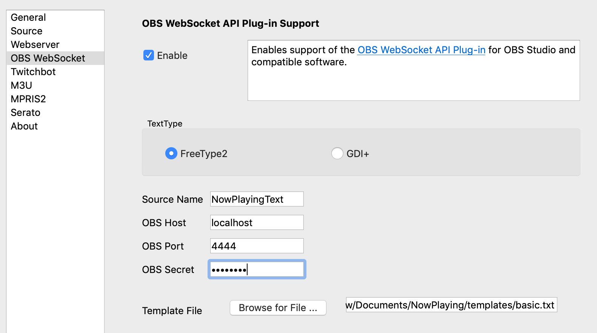

OBS WebSocket Plug-in
=====================

**What's Now Playing** can use the OBS WebSocket v5 protocol to send results
directly to OBS Studio.  OBS WebSocket v5 protocol was added as a standard feature
in OBS Studio v28.  It will not work with older versions.

Installation
------------

#. Configure the OBS WebSocket settings in OBS Studio (Tools->obs-websocket Settings)
#. Configure OBS to have a Text source, keeping track of the name of the source name.
#. Open Settings from the **What's Now Playing** icon
#. Select OBS WebSocket from the list of available input sources.

#. Check Enable
#. Set the Source Name to be the same as your Source in OBS Studio.
#. In OBS Studio, under Tools->obs-websocket Settings, select Show Connect Info
#. In **What's Now Playing**, set the OBS Host, OBS Port, and OBS Secret. If the machine running OBS and running **What's Now Playing** are the same host, set OBS Host to be 'localhost'
#. Browse and select the template file that you would like to use as output.
#. Click Save
