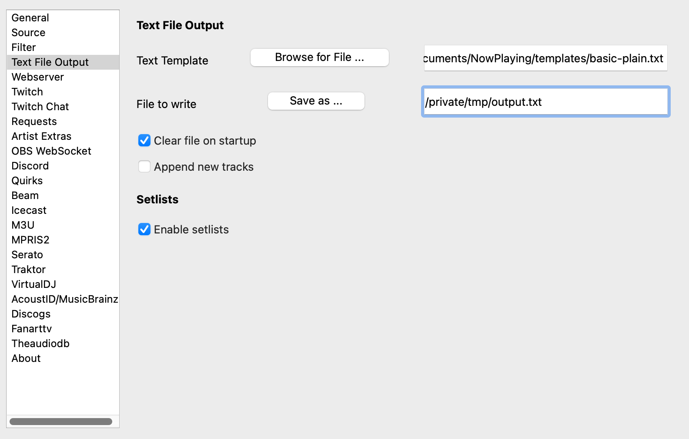

Text Output
=====================

A simple output method that just writes a template to a file and writes the entire setlist on exit.

*
  **Text Template** - The `Jinja2 template <https://jinja.palletsprojects.com/en/2.11.x/templates/>`_ file that will be used when the song updates. See `Templates <../templatevariables.html>`_ for more information.

*
  **File to write** - Name of the file where the app will write the track information.  You can either pick a pre-existing file or the name of a new file.

*
  **Clear file on startup** - Empty the file when **What's Now Playing** is launched.

*
  **Append new track** - Keep adding new tracks to the file rather than replace the content.

*
  **Enable setlists** - Setting this option will create a file in the NowPlaying/setlists directory when **What's Now Playing** is
  shutdown of all of the tracks that were played as GitHub-flavored markdown table.
