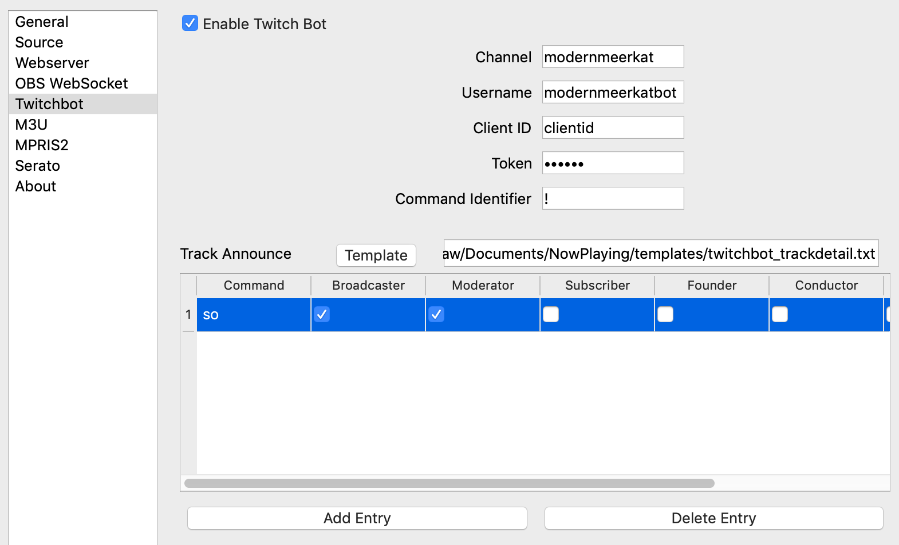

TwitchBot
=========

Now Playing support direct integration with Twitch chat by incorporating a very simple
bot. It takes any command and looks for an equivalent twitchbot template
file.

For example, in chat if the user types::

!track

it will look for a file called ``twitchbot_track.txt``.  Permissions for commands may be set
in the Twitchbot settings section.

Additionally, Twitchbot has the ability to send an announcement template to chat when
Now Playing detects a song change.

Creating a Bot Account
----------------------

#. In order to get the most out of the Twitchbot, it is recommended to setup another
   account on Twitch.  Create the account and be sure to enable:

   * Multiple logins per email
   * Two factor authentication (2FA)

.. image:: images/twitchbot-account-settings.png
   :target: images/twitchbot-account-settings.png
   :alt: Account Settings for bots

#. On the bot's account, go to `Twitch Dev Settings <https://dev.twitch.tv>`_ to
   register Now Playing.

   #. Click Login in the upper right
   #. Click on "Your Console" in the upper right
   #. Click on "Applications"
   #. Click on "Register Your Application"
   #. Name: login name used by the bot account
   #. OAuth Redirect URLs: http://localhost
   #. Category: Chat Bot
   #. Create
   #. Click on "Manage" and save a copy of the Client ID

#. Get an OAuth Token:

   #. Go to `TMI <http://twitchapps.com/tmi>`_.
   #. Authentication
   #. Copy the Token down

#. Make the bot account a moderator of your channel so that it does not have chat
   time limits, etc on it.

At the end of this process, you should have four pieces of information:

* Bot's Username:
* Bot's ClientID:
* Bot's Token:
* Your Twitch Stream/Channel:

You will need to provide all four to the Twitchbot Settings.

Installation
------------

#. Open Settings from the Now Playing icon
#. Select Twitchbot from the list of available input sources.

#. Check Enable
#. Provide the four pieces of authentication information above.
#. If you would like to have the bot announce new tracks in chat, select the template.
#. Click Save

Setting Permissions
-------------------

By default, all commands are available to everyone on your channel's chat.  If you wish to
limit commands, add the command to the Twitchbot settings and check the types of users
who should be able to execute them.

Adding New Commands
-------------------

Sipmly create a new file in the ``Documents/Now Playing/template`` directory called
``twitchbot_yourcommand.txt`` where ``yourcommand`` is the actual command that will be
executed by users that has the appropriate template code inside it.
Note that all text will be smashed together as a single line when sent to Twitch, so
be mindful of where to put spaces.

Troubleshooting
---------------

* If the bot never connects, try getting a new OAuth token.

* Be aware that the bot may have trouble connecting if you restart Now Playing too
  quickly.  It should eventually rejoin but it may take several minutes.

Additional Variables
--------------------

For the purposes of templating, the TwitchBot provides the following additional features:

.. list-table::
   :header-rows: 1

   * - Variable
     - Description
   * - cmduser
     - Person, bot, etc that typed the command
   * - cmdtarget[x]
     - The x'th target on the command, starting with 0.  For example, if the command was `!so modernmeerkat`,
       then `{{ cmdtarget[0] }}` will have `modernmeerkat` in it. See below for an example.

Multiple Targets
^^^^^^^^^^^^^^^^

One of the more advanced capabilities that the TwitchBot supports is a variable number of targets.  This feature
allows for your users to use one command to perform actions on, for example, multiple users.

A simple example. Given this template file::

  @{{ cmduser }} hugs @{{ cmdtarget[0] }}

a user typing::

  modernmeerkat: !hug twitch

Would result in::

  bot: @modernmeerkat hugs @twitch

But this can be expanded to do multiple users at once::

  @{{ cmduser }} sends hugs to @{{ people }} 

such that::

  modernmeerkat: !hug person1 person2 person3

results in::

  bot: @modernmeerkat sends hugs to @person1 @person2 @person3
