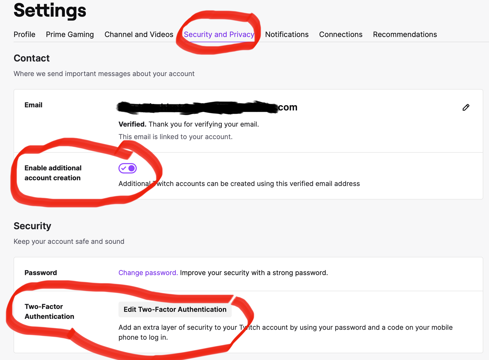
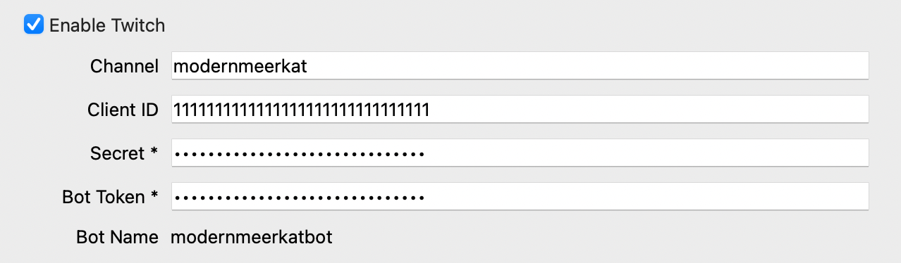
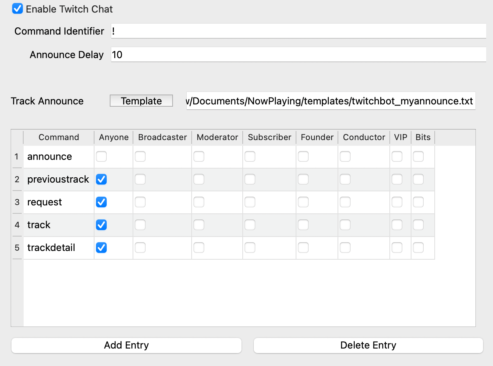

TwitchBot
=========

**What's Now Playing** integrates with Twitch with channel point redemptions and/or chat.  They
may be run independently or run both at the same time.

Twitch Chat Support
-------------------

The chat bot support includes track announcement as well as interactive features.

For example, in chat, if the user types::

!track

**What's Now Playing** will read a file called ``twitchbot_track.txt`` and expand any
template values in it.  The Twitchbot settings section sets permissions
for commands.

Additionally, the Twitchbot can send an announcement template to chat when **What's Now Playing** detects a song change
or when a track Request has been fulfilled.

Twitch Channel Point Redemptions
--------------------------------

Currently, channel point redemptions allow for users to request songs, either by
artist/title or picking a random song in a 'roulette' mode when that redemption
is tied to a supported DJ's software crate/playlist.  For more information see
`Requests <../requests/>`_.

Authentication
--------------

You can choose to either use your own account or create a new account for your bot.  It is generally recommended
to create a new account and these instructions are following those guidelines.

#. Follow the Twitch process for creating a new account.
#. On the new account, be sure to enable:

   * Multiple logins per email
   * Two-factor authentication (2FA)

#. Go to `Twitch Dev Settings <https://dev.twitch.tv>`_ to
   register **What's Now Playing**.

   #. Click Login in the upper right
   #. Click on "Your Console" in the upper right
   #. Click on "Applications"
   #. Click on "Register Your Application"
   #. Name: login name used by the bot account
   #. OAuth Redirect URLs: http://localhost:17563
   #. Category: Chat Bot
   #. Create
   #. Click on "Manage" and save a copy of the Client ID.
   #. Click on 'New Secret'. Save a copy of the Client Secret.

#. Get an OAuth Token:

   #. Go to `TMI <http://twitchapps.com/tmi>`_.
   #. Authentication
   #. Copy the Token down

#. At the end of this process, you should have four pieces of information:

  * Your Twitch Stream/Channel:
  * Bot's Client ID:
  * Bot's Client Secret:
  * Bot's Token:

#. Open Settings from the **What's Now Playing** icon.
#. Select Twitch from the list of settings available.
#. Fill in the information in **What's Now Playing**'s  Twitch setting:

You will need to provide all four to the Twitchbot Settings.  Additionally,
you should consider making the bot a moderator on your channel to avoid limits,
such as the message posting rate, URL filters, etc.

For certain services, such as channel point redemptions, launching **What's Now Playing**
will also launch a browser in order to authenticate the bot to your channel.

Twitch Chat Configuration
-------------------------

#. Open Settings from the **What's Now Playing** icon
#. Select Twitch Chat from the list of settings available.

#. Check Enable
#. To have the bot announce new tracks in chat, select the template.

You are now ready to set permissions on user interactive commands.

Setting Permissions
^^^^^^^^^^^^^^^^^^^

Upon launch, **What's Now Playing** will create an entry for every `twitchbot_*.txt` file
in the template directory.  These entries will all be set to completely disabled.  In order
to enable them, you will need to check the appropriate field.

Twitchbot template files added while **What's Now Playing** is running will let anyone
use them until the next run.  At the next run, it will again change them back to no permissions
granted.

Once the permissions are set and Save is clicked, those permissions will be preserved on
every restart.

Adding New Commands
^^^^^^^^^^^^^^^^^^^

Create a new file in **What's Now Playing**'s``templates`` directory
(``Documents/Now Playing/template``) called ``twitchbot_yourcommand.txt``
where ``yourcommand`` is the actual command that will be
executed by users that have the appropriate template code inside it.
Note that all text will be smashed together as a single line when sent to Twitch, so
be mindful of where to put spaces.

Built-in Commands
^^^^^^^^^^^^^^^^^

Post-v3.0.2, the Twitchbot will always respond to the command 'whatsnowplayingversion' . It
will report the version that is running.

Troubleshooting
^^^^^^^^^^^^^^^

* To test if the chat bot is working, you should be able to use the '!whatsnowplayingversion'
  command.  **What's Now Playing** only needs to be running.  You do not have to be live
  streaming to test chat.

* If the bot never connects, try getting a new OAuth token.

* Be aware that the bot may have trouble connecting if you restart **What's Now Playing** too
  quickly.  It should eventually rejoin, but it may take several minutes.

Additional Variables
^^^^^^^^^^^^^^^^^^^^

The TwitchBot adds the following additional values for templating purposes:

.. list-table::
   :header-rows: 1

   * - Variable
     - Description
   * - cmduser
     - Person, bot, etc that typed the command
   * - cmdtarget[x]
     - The x'th target on the command, starting with 0.  For example, if the command was `!so modernmeerkat`,
       then `{{ cmdtarget[0] }}` will have `modernmeerkat` in it. See below for an example.
   * - startnewmessage
     - Split the text at this location and start a new message to send to chat.

Multiple Targets
^^^^^^^^^^^^^^^^

One of the more advanced capabilities that the TwitchBot supports is a variable number of targets.  This feature
allows for your users to use one command to perform actions on, for example, multiple users.

A simple example. Given this template file::

  @{{ cmduser }} hugs @{{ cmdtarget[0] }}

a user typing::

  modernmeerkat: !hug twitch

Would result in::

  bot: @modernmeerkat hugs @twitch

But this can be expanded to do multiple users at once::

  @{{ cmduser }} sends hugs to @{{ people }} 

such that::

  modernmeerkat: !hug person1 person2 person3

results in::

  bot: @modernmeerkat sends hugs to @person1 @person2 @person3

Announcing Websites
^^^^^^^^^^^^^^^^^^^

You may want to add support for announcing the website data as part of the Twitchbot
track announcement.  You can pick and choose which websites are printed by taking
the following code snippet and modifying as necessary:

.. code-block:: jinja

  
  
   |Bandcamp: {{ website }}
   | Discogs: {{ website }}
   | Facebook: {{ website }}
   | IG: {{ website }}
   | last.fm: {{ website }}
   | MusicBrainz: {{ website }}
   | Twitter: {{ website }}
   | Wikipedia: {{ website }}
   | YouTube: {{ website }}
   | Official homepage: {{ website }}
  
  
  
