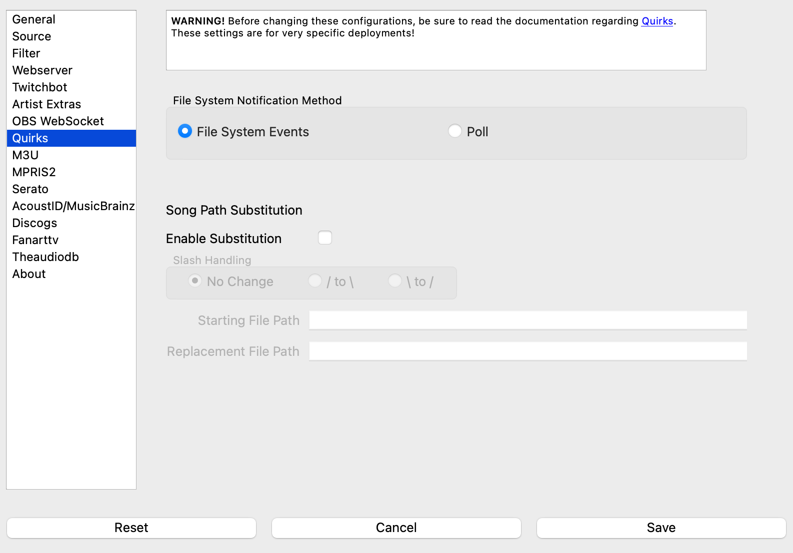

Quirks
======

Under some very specialized circumstances, it may be necessary to 'nudge' **What's Now Playing**
to do something particularly special in order to get the desired impact.  The options
under quirks allow one to do just that.  In general, however, users should stick with
the defaults for optimal performance.

File System Notification Method
-------------------------------

By default, **What's Now Playing** uses operating system facilities to know when input
files have changed.  If `**What's Now Playing** is running on a different host than the
DJ software and **What's Now Playing** have been configured to read the DJ
software's directory
over a network mount (such as SMB) **What's Now Playing** may not get notified that
a file
has changed.  Selecting the `poll` option will force the application to perform
a manual file system check.  The drawbacks to this method are that more CPU
and disk IO is performed and being on delay to get updates.  However, the
software will not miss events.

      NOTE: Changing this value REQUIRES a restart of the **What's Now Playing** software.

Song Path Substitution
----------------------

Like the previous issue, the DJ software's files may reference a file path
unlike what **What's Now Playing** has access to on the machine where it is
running.  Setting these values will allow you to do a 'search and replace' of
any referenced song files.

For example:

  - Starting File Path is set to ``/Volumes/Music/``
  - Replacement File Path is set to ``/Macintosh HD/Music/``

The DJ software says that it read ``/Volumes/Music/Blondie/Heart_of_Glass.mp3``.  **What's Now Playing**
will instead interpret that the filename is actually
``/Macintosh HD/Music/Blondie/Heart_of_Glass.mp3`` when reading extra tags, performing recognition, etc.

The Slash Handling setting allows you to switch the direction of all slashes in
the filenames.  This setting is beneficial when substituting filenames from
Windows to other operating systems and vice-versa.  The slash changes happen
before path substitution, so keep that in mind.  For example,

  - Slash Handling: ``\ to /`` is set
  - Starting File Path: ``Z:/av``
  - Replacement File Path: ``/av``

If the original file was ``Z:\av\Music\Band\Cool Song.mp3``, the above settings will change that
to ``/av/Music/Band/Cool Song.mp3``.  Another example:

  - Slash Handling: ``/ to \`` is set
  - Starting File Path: ``\av``
  - Replacement File Path: ``Z:\av``

will do the reverse, from ``/av/Music/Band/Cool Song.mp3`` to ``Z:\av\Music\Band\Cool Song.mp3``

      NOTE: This quirk is not supported with MPRIS2.
