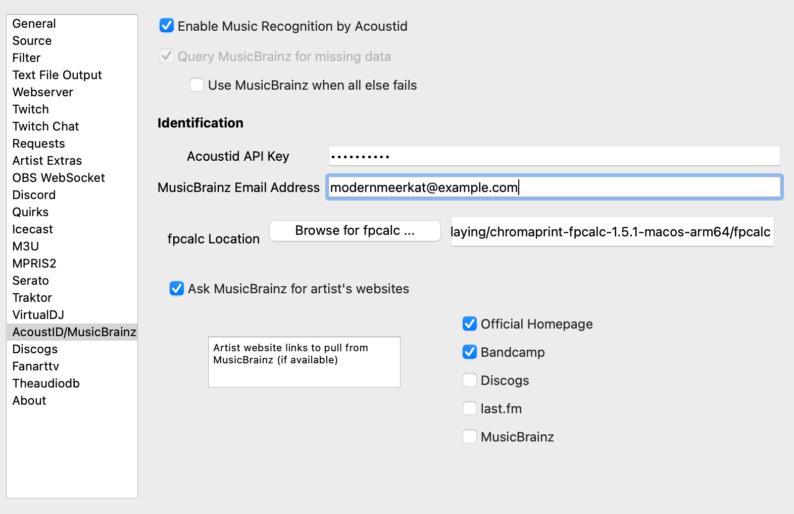

AcoustID/MusicBrainz
======================

The acoustidmb feature attempts to use two freely available resources to retrieve
metadata for untagged files.

AcoustID
--------

AcoustID is a project providing a complete audio identification service
based entirely on open-source software.  The service is completely free
for non-commercial applications. All you need to do is
`register your application <https://acoustid.org/new-application>`_.

As part of the identification, AcoustID requires

* MusicBrainz enabled.
* `fpcalc binary <https://acoustid.org/chromaprint>`_ installed

Note that AcoustID's database is not as large or as comprehensive as, for example, Shazam.  Additionally,
it only samples the beginning of the song so media with long introductions before the core of the
music starts (e.g., music videos) may not be correctly identified.

MusicBrainz
-----------

MusicBrainz is an open music encyclopedia that collects music metadata and makes it available to the public.
**What's Now Playing** may use MusicBrainz to fill in missing data beyond what is already tagged, if enabled.

MusicBrainz aims to be:

    The ultimate source of music information by allowing anyone to contribute and releasing the data under open licenses.
    The universal lingua franca for music by providing a reliable and unambiguous form of music identification, enabling both people and machines to have meaningful conversations about music.

Like Wikipedia, MusicBrainz is maintained by a global community of users and we want everyone — including you — to participate and contribute.

MusicBrainz is operated by the MetaBrainz Foundation, a California based 501(c)(3) tax-exempt non-profit corporation dedicated to keeping MusicBrainz free and open source.

MusicBrainz Instructions
------------------------

#. Open Settings from the **What's Now Playing** icon
#. Select AcoustID/MusicBrainz from the left-hand column
#. Select `Query MusicBrainz for missing data`
#. Fill in the `MusicBrainz Email Address`
#. If you would like the data fetched to include artist website data, then select `Ask MusicBrainz for artist's websites` and which types of websites you would like included.
#. Click `Save`

AcoustID Instructions
---------------------

#. Install `fpcacle binary <https://acoustid.org/chromaprint>`_ as appropriate for your operating system.
#. Open Settings from the **What's Now Playing** icon
#. Select AcoustID/MusicBrainz from the left-hand column
#. Enable the option
#. Fill in the API Key you received from Acoustid
#. Fill in the `MusicBrainz Email Address`
#. Set the location of the fpcalc executable that was installed.
#. Any additional MusicBrainz configuration
#. Click Save

**What's Now Playing** will now use AcoustID and MusicBrainz to provide supplementary metadata that
was not provided by either the DJ software or tags that were read from the file.
