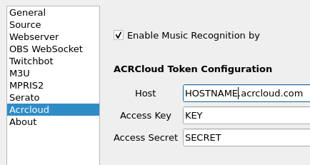

ACRCloud
========

.. image:: images/ACRCloud-logo.png
   :target: images/ACRCloud-logo.png
   :alt: ACRCloud logo

ACRCloud utilises patented Automatic Content Recognition (ACR) technology to
enable the generation of a unique real-time fingerprint to identify in a matter
of seconds, the content being played via an audio or video source which is typically
a first screen, in order to trigger an action. With proprietary audio identification
technology, ACRCloud’s is able to identify millions of hours of content in both a
manageable and efficient manner that is highly relevant for advertisers, broadcasters,
video streaming providers, music services, consumer electronics manufacturers and app
developers. ACR’s fingerprint library includes 40 million audio tracks, which is one
of the biggest in the world.

You can learn more and sign up for ACRCloud's commercial services at https://www.acrcloud.com .

In order for this feature to work on Windows, you will need to install the
`Windows Runtime Library <https://github.com/acrcloud/acrcloud_sdk_python#windows-runtime-library>`.
Linux and Mac OS X users do not need any extra software installed.

Instructions
------------

#. Open Settings from the Now Playing icon
#. Select ACRCloud from left-hand column
#. Enable the option
#. Fill in the information as provided by the ACRCloud Console
#. Click Save

Now Playing will now use ACRCloud to provide supplementary metadata that was not provided by
either the DJ software or tags that were read from the file.