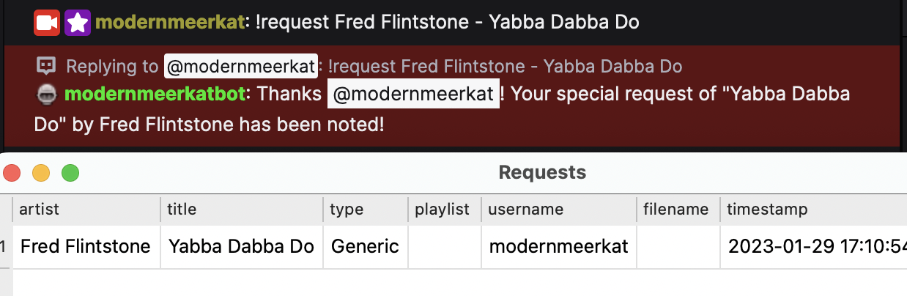
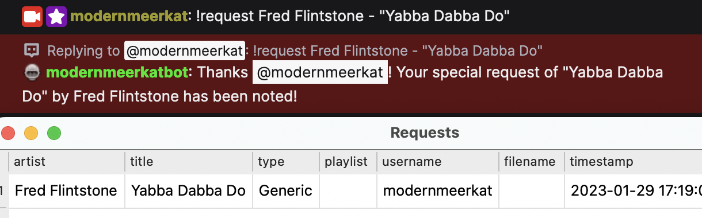
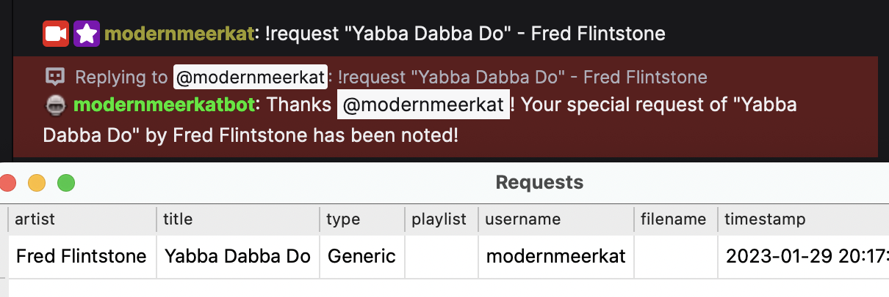
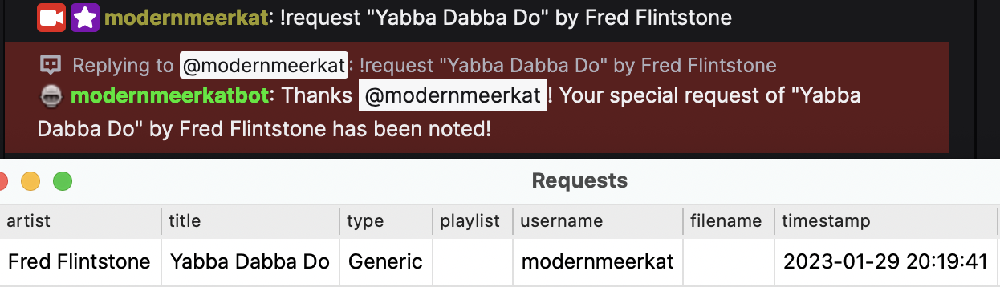
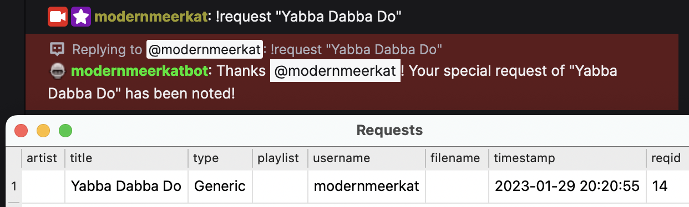
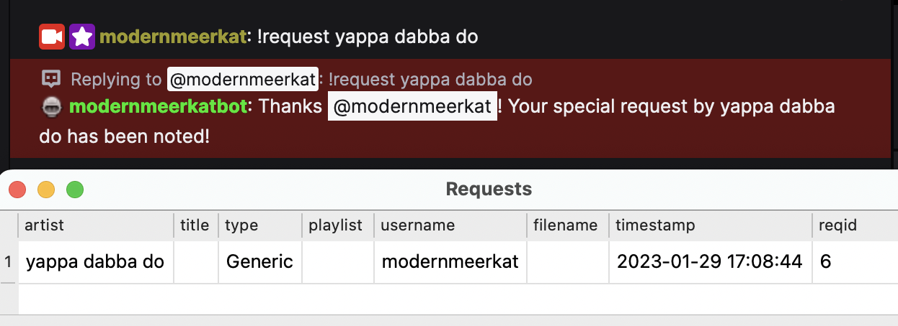

User Track Requests
====================

**What's Now Playing** has the ability to help manage requests that come from Twitch users.

There are three types of requests, generic, twofers, and roulette:

* Generic requests are just that, user may request any track by specifying the artist and title.
* Twofers are requests where the artist is the currently playing artist and (optionally) a particular track may be selected.
* Roulette requests will pick a random song from the specified playlist/crate as the request.

.. image:: images/requests_generic.png
   :target: images/requests_generic.png
   :alt: Request Window

If **What's Now Playing** detects the song has been played, it will be removed
from the Requests queue.

Using Twitch Chat for Requests
------------------------------

To enable Twitch chat to be used for requests:

#. Configure and enable Twitch Chat support.
#. Create a command that will be used for requests. There is an example template file
   called 'twitchbot_request.txt' as an example.
#. Assign that command to the appropriate entry in the Requests settings in **What's Now Playing**.
   See later on below.

For non-roulette requests, artist and title information should be entered on the
chat line.  For example:

.. code-block::

  modernmeerkat: !request Blur - "Parklife"
  modernmeerkatbot: Thanks @modernmeerkat! Your special request of "Parklife" by Blur has been noted!

Supported Request Formats
-------------------------

The following formats are supported, either as a chat command or as the
optional text in a Twitch Channel Point Redemption:

* artist - title

* artist - "title"

* "title" - artist

* "title" by artist

* "title"

Additionally, the following formats can be used to request a track for someone else:

* artist - "title" for @username
* "title" by artist for @username

(Note that the username is not currently saved or processed in any way.)

Unless Twofer is being redeemed, anything else will be considered an artist. For example:

For Twofers, anything else will be considered a track title since the artist
will always be the currently playing artist.  Twofers are not required to have additional
input.  In that case, the title will be blank.

Using Twitch Redemptions for Requests
--------------------------------------

To enable Twitch redemptions to be used for requests:

#. Configure and enable Twitch support with Client and Secret IDs.
#. Create a a reward in the Twitch UI.  Keep track of the _exact_ text used in the reward description.
#. If the channel redemption is not a roulette request, then the reward should take user input to
   provide the artist and title information.
#. Copy the exact text into the 'Redemption Text' field in the appropriate entry in the
   Requests settings in **What's Now Playing**.

   NOTE: **What's Now Playing** does not manage the Twitch-side Reward Requests Queue.  You will
   still need to approve or refund channel points in the Twitch moderator panel.

Configuring Requests
--------------------

.. image:: images/requests_settings.png
   :target: images/requests_settings.png
   :alt: Request Settings

#. Under Settings, select Requests.
#. Enable Requests support
#. Enable one or both of Twitch Channel Redemption Requests and Twitch Chat Requests depending
   upon your needs.

#. Add Entry
#. Change the Chat Command to the Twitch Chat command in order to enable this Request via chat.
#. Put in the exact Twitch reward text in the Redemption Text field to enable this Request via channel points.
#. Select the mode as appropriate.  By default, Generic will be used.
#. Fill in a displayname.  This name will be shown to users when referencing requests of this type.
#. For roulette requests, enter in the playlist or crate name.  See below for more information.

Roulette Playlists
------------------

In order for Roulette requests to work, **What's Now Playing** needs to have a list of tracks to
use.  The name here should match the name that your DJ software also uses:

Serato:  The name of the crate or smart crate.
Virtual DJ: playlist name
Traktor: playlist name

  NOTE: See the section on your particular DJ software for known caveats/issues.

If the random song picked is not desired (inappropriate, already played, etc), you may force
the software to re-pick:

#. Selecting the track in the Requests window.
#. Click Respin
#. Wait a few moments for the software to pick a new one. (It does not do it immediately.)
#. The track should get replaced with a different one.
#. If it is still not desired, repeat this process as many times as necessary.

The software will keep track of which artists have been played during Roulette.
It will try to avoid repeating the same artist in the same DJ session.  If it
runs out or cannot pick one a non-duplicate fast enough, it will still offer up
a duplicate artist.

  NOTE: There is no notification to users that Respin has been selected.

  NOTE: For Traktor and Virtual DJ, Roulette requests require local files.

