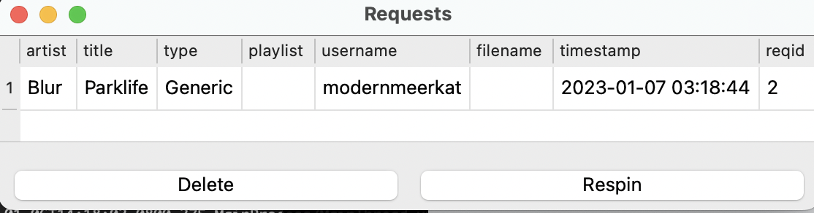
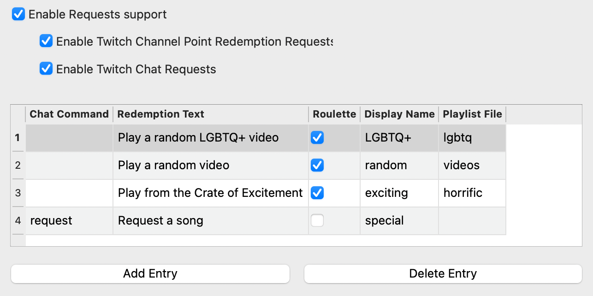

User Track Requests
====================

**What's Now Playing** has the ability to help manage requests that come from Twitch users.

There are two types of requests, roulette and non-roulette.  Roulette requests will pick a
random song from the given playlist/crate as the request.  Non-roulette require the user
to provide the title and optionally the artist.

If **What's Now Playing** detects the song has been played, it will be removed from the
Requests queue.

Using Twitch Chat for Requests
------------------------------

To enable Twitch chat to be used for requests:

#. Configure and enable Twitch Chat support.
#. Create a command that will be used for requests. There is an example template file
   called 'twitchbot_request.txt' as an example.
#. Assign that command to the appropriate entry in the Requests settings in **What's Now Playing**.
   See later on below.

For non-roulette requests, artist and title information should be entered on the
chat line.  For example:

.. code-block::

  modernmeerkat: !request Blur - "Parklife"
  modernmeerkatbot: Thanks @modernmeerkat! Your special request of "Parklife" by Blur has been noted!

Using Twitch Redemptions for Requests
--------------------------------------

To enable Twitch redemptions to be used for requests:

#. Configure and enable Twitch support with Client and Secret IDs.
#. Create a a reward in the Twitch UI.  Keep track of the _exact_ text used in the reward description.
#. If the channel redemption is not a roulette request, then the reward should take user input to
   provide the artist and title information.
#. Copy the exact text into the 'Redemption Text' field in the appropriate entry in the
   Requests settings in **What's Now Playing**.

   NOTE: **What's Now Playing** does not manage the Twitch-side Reward Requests Queue.  You will
   still need to approve or refund channel points in the Twitch moderator panel.

Configuring Requests
--------------------

#. Under Settings, select Requests.
#. Enable Requests support
#. Enable one or both of Twitch Channel Redemption Requests and Twitch Chat Requests depending
   upon your needs.

#. Add Entry
#. Change the Chat Command to the Twitch Chat command in order to enable this Request via chat.
#. Put in the exact Twitch reward text in the Redemption Text field to enable this Request via channel points.
#. If this request is meant to be a Roulette, check the Roulette box.
#. Fill in a displayname.  This name will be shown to users when referencing requests of this type.
#. For roulette requests, enter in the playlist or crate name.  See below for more information.

Roulette Playlists
------------------

In order for Roulette requests to work, **What's Now Playing** needs to have a list of tracks to
use.  The name here should match the name that your DJ software also uses:

Serato:  The name of the crate or smart crate.
Virtual DJ: playlist name
Traktor: playlist name

  NOTE: See the section on your particular DJ software for known caveats/issues.

If the random song picked is not desired (inappropriate, already played, etc), you may force
the software to re-pick:

#. Selecting the track in the Requests window.
#. Click Respin
#. Wait a few moments for the software to pick a new one. (It does not do it immediately.)
#. The track should get replaced with a different one.
#. If it is still not desired, repeat this process as many times as necessary.

  NOTE: There is no notification to users that Respin has been selected.
