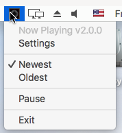

Usage
=====

Start the **What's Now Playing** app from the location where you placed it. The app is controlled and
configured by accessing the menu from the icon in the Windows system tray or Mac
menu bar after configuration.

However, the first time you run the app, a `Settings <settings.html>`_ window will appear.
Populate the fields accordingly, and press Save. Once saved, the app will start polling
for new songs. The app can be controlled and exited from...

the macOS menu bar icon:

.. image:: images/snpMac.gif
   :target: images/snpMac.gif
   :alt: Mac menu bar animation

or the Windows system task tray:

.. image:: images/snpWin.gif
   :target: images/snpWin.gif
   :alt: Windows menu bar animation

The menu bar:

includes the following options:

* Settings

  * Reconfigure the application after going through the initial configuration.
    See `Settings <settings.html>`_ for more information.

* Oldest/Newest

  * Toggle that determines which mixing mode is currently used. Not all Sources support both modes. Be sure to check the documentation for your particular Source.

    * Oldest mode will pick the oldest track from all decks.  This setting is for DJs who are using the non-playing deck or will be manually controlling cross-fades.
    * Newest mode will pick the newest track from all decks.  This setting is helpful for pre-built
      playlists or Serato's AutoDJ capability.

* Pause/Unpause
  - Determines whether **What's Now Playing** is looking for data and writing an updated title.

* Exit
  - Stop and exit **What's Now Playing**
